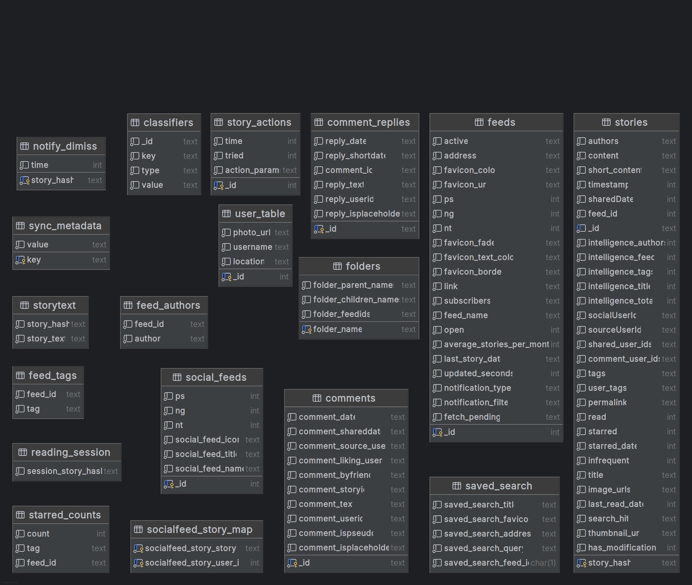
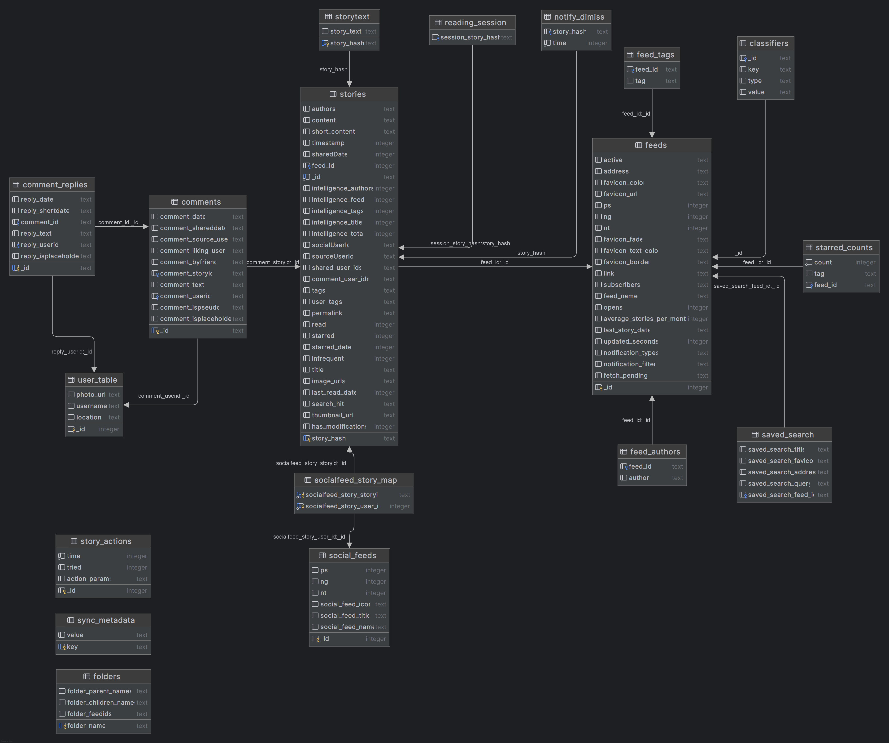

# Database

Ce répertoire contient les fichiers et analyses liés à la base de données du projet NewsBlur. Ici, nous stockons les données extraites, les schémas intermédiaires et les analyses préliminaires de la structure de la base de données de l'application Android NewsBlur.

## Contenu

- Fichiers de données extraites de l'application
- Analyses de la structure de la base de données
- Schémas partiels et diagrammes

## Schéma physique

## Schéma physique enrichi avec les FKs

